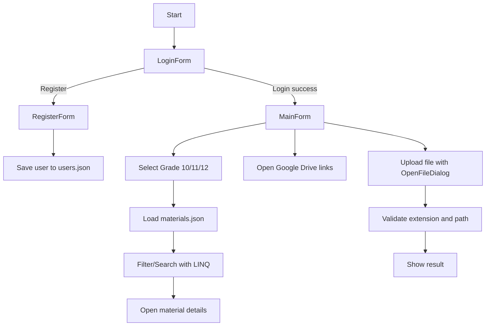

# Блок-схема алгоритма

```mermaid
flowchart TD
A[Start] --> B[LoginForm]
B -->|Register| C[RegisterForm]
C --> D[Save user to users.json]
B -->|Login success| E[MainForm]
E --> F[Select Grade 10/11/12]
F --> G[Load materials.json]
G --> H[Filter/Search with LINQ]
H --> I[Open material details]
E --> J[Open Google Drive links]
E --> K[Upload file with OpenFileDialog]
K --> L[Validate extension and path]
L --> M[Show result]
```
