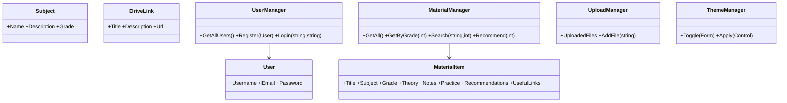

# МЭСК (MESC)

Современная WinForms платформа подготовки к экзаменам для 10-12 классов.

## Функции
- Авторизация и регистрация с JSON-хранилищем.
- Dashboard с sidebar, поиском и фильтрацией по классам.
- Раздел материалов (теория/конспекты/практика/рекомендации).
- Открытие Google Drive ссылок через браузер.
- Загрузка файлов (PDF/DOCX/TXT/PPTX).
- Сохранение загруженных файлов в `Data/uploads.json` (история загрузок).
- Светлая/тёмная тема.

## Структура
- `MESC/Forms` — формы приложения.
- `MESC/Models` — модели предметной области.
- `MESC/Managers` — бизнес-логика.
- `MESC/Data` — JSON-данные.
- `MESC/Docs` — UML/ERD/блок-схема.

## Запуск
1. Открыть `MESC.sln` в Visual Studio 2019+.
2. Запустить проект `MESC`.

## Где настраивать Google Drive ссылки
- Добавляйте/редактируйте любое количество ссылок в `MESC/Data/drive_links.json`.
- Раздел `Google Drive` в приложении автоматически читает этот файл.

## Как заполнить предметы материалами
- Все учебные материалы хранятся в `MESC/Data/materials.json`.
- Формат каждой записи:
  - `Title` — название темы
  - `Subject` — предмет (например, `Математика`, `Физика`)
  - `Grade` — класс (`10`, `11`, `12`)
  - `Theory`, `Notes`, `Practice`, `Recommendations`, `UsefulLinks`
- Добавляйте новые объекты в JSON-массив — приложение автоматически покажет их в разделе `Материалы` с фильтрацией по классу и поиском.

## UML диаграмма классов

